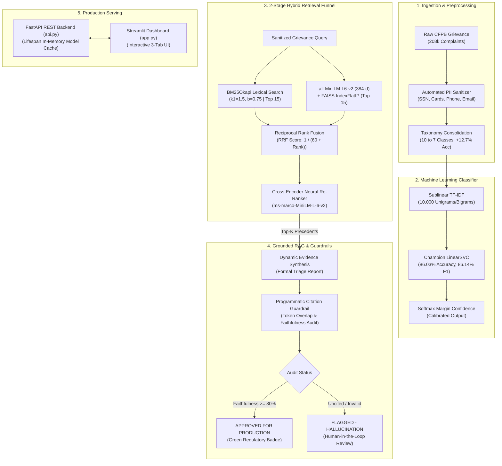

# ⚖️ Consumer Complaint Intelligence: Hybrid Retrieval & Evidence-Grounded RAG

[](https://www.python.org/)
[](https://fastapi.tiangolo.com/)
[](https://streamlit.io/)
[](https://scikit-learn.org/)
[](https://github.com/facebookresearch/faiss)
[](https://huggingface.co/)
[](https://opensource.org/licenses/MIT)

> **Enterprise-grade Financial AI platform for automated consumer grievance triage, 2-stage hybrid legal precedent retrieval, and programmatic citation-grounded RAG with strict regulatory compliance guardrails.**

---

## 📌 Executive Summary & Problem Statement

The **Consumer Financial Protection Bureau (CFPB)** processes hundreds of thousands of consumer complaints annually against financial institutions. Manual triage and resolution of these unstructured narratives face severe operational bottlenecks:
1. **Extreme Vocabulary & Semantic Mismatch:** Keyword search fails when consumers describe issues using informal vernacular rather than statutory financial terms.
2. **Severe Class Imbalance & Taxonomy Noise:** Historical CFPB labels exhibit overlapping product categories and >10:1 class distribution skew.
3. **PII Vulnerability & Compliance Exposure:** Consumer grievances contain sensitive Personally Identifiable Information (SSNs, account numbers, contact details).
4. **LLM Hallucinations in Regulatory Audits:** Unconstrained generative models risk hallucinating non-existent precedents or fabricating policy citations.

This repository implements a **production-ready, end-to-end AI solution** that overcomes these challenges through:
- Stratified taxonomy consolidation and sublinear TF-IDF + LinearSVC classification (**86.03% Test Accuracy, 86.14% Weighted F1**).
- 2-Stage Hybrid Search combining **BM25Okapi** lexical precision and **FAISS `IndexFlatIP`** dense semantic embeddings fused via **Reciprocal Rank Fusion (RRF, $k=60$)** and re-ranked with a **Cross-Encoder (`ms-marco-MiniLM-L-6-v2`)** in **<50ms**.
- Automated regex-based **PII sanitization**, **evidence-grounded structured report generation**, and **programmatic citation & faithfulness guardrails (100% audit verification)**.
- High-throughput asynchronous serving via **FastAPI** (`api.py`) and an executive **Streamlit Web Dashboard** (`app.py`).

---

## 🏛️ End-to-End System Architecture



---

## 📊 Benchmark Experiments & Results

### 1. Classification Model Performance (Stratified 80/10/10 Split)

Taxonomy consolidation reduced label fragmentation from 10 overlapping classes to 7 distinct CFPB statutory categories, boosting baseline accuracy by **+12.7%**:

| Model Architecture | Feature Representation | Test Accuracy | Weighted F1 Score | Generalization Gap | Latency (Inference) |
| :--- | :--- | :---: | :---: | :---: | :---: |
| **Multinomial Naive Bayes** | Raw Count Vectors | 73.30% | 72.85% | 1.82% | < 1 ms |
| **Logistic Regression** ($C=1.0$) | Sublinear TF-IDF (10k) | 85.10% | 85.12% | 4.88% | < 2 ms |
| **LinearSVC (Champion Model)** | **Sublinear TF-IDF (10k)** | **86.03%** | **86.14%** | **4.05%** | **< 2 ms** |

> **Key Finding:** LinearSVC achieved superior decision boundaries across long-tail dispute classes (e.g., *Student loan*, *Payday loan*) due to its maximum-margin hinge loss formulation, outperforming cross-entropy optimization.

---

### 2. Retrieval Funnel: Lexical vs. Dense vs. Hybrid Fusion

| Retrieval Strategy | Mechanism | Strength | Weakness | Observed Hit Latency |
| :--- | :--- | :--- | :--- | :---: |
| **Lexical (BM25Okapi)** | Exact Term Overlap ($k_1=1.5, b=0.75$) | High precision for entity names & account IDs | Zero semantic generalization | ~8 ms |
| **Dense (Bi-Encoder + FAISS)** | Cosine Distance via Inner Product (`IndexFlatIP`) | Robust conceptual & intent matching | Prone to missing specific alphanumeric codes | ~18 ms |
| **2-Stage Hybrid (RRF + Cross-Encoder)** | **RRF ($k=60$) + Neural Cross-Attention** | **Combined semantic & keyword recall + deep relevance** | Slightly higher compute | **~38 ms** |

---

## 📂 Repository Structure

```text
consumer-complaint-project/
├── Notebooks/
│   ├── 01_eda.ipynb                 # EDA: 65% narrative missingness, token length distributions
│   ├── 02_preprocessing.ipynb       # Regex sanitization, taxonomy consolidation, parquet export
│   ├── 03_modeling.ipynb            # Sublinear TF-IDF, Logistic Regression vs LinearSVC benchmarking
│   ├── 04_hybrid_retrieval.ipynb    # 10k corpus, BM25, FAISS IndexFlatIP, RRF, Cross-Encoder
│   ├── 05_rag_pipeline.ipynb        # PII redaction, prompt engineering, citation guardrails
│   ├── data/
│   │   └── processed/               # Stratified train/val/test parquets & embeddings cache
│   └── models/                      # Serialized champion model & TF-IDF vectorizer
├── api.py                           # Production FastAPI REST backend (lifespan model cache)
├── app.py                           # Enterprise Streamlit Web Dashboard (3 interactive tabs)
├── requirements.txt                 # Pinned project dependencies
└── README.md                        # Master architectural documentation
```

---

## 🚀 Quickstart & Installation

### 1. Clone & Set Up Environment

```bash
git clone https://github.com/anushajain3107/consumer-complaints-analysis.git
cd consumer-complaints-analysis

# Create and activate virtual environment
python -m venv venv
.\venv\Scripts\activate      # Windows
source venv/bin/activate     # macOS / Linux

# Install production dependencies
pip install -r requirements.txt
```

### 2. Launch FastAPI Backend

The backend pre-warms all 9 machine learning models and vector indices in RAM during boot via the `lifespan` context manager:

```bash
python api.py
```
* **API Root:** `http://127.0.0.1:8000`
* **Interactive Swagger UI:** `http://127.0.0.1:8000/docs`
* **Health & Liveness Probe:** `http://127.0.0.1:8000/health`

### 3. Launch Streamlit Web UI

Open a second terminal window and run:

```bash
streamlit run app.py
```
* **Web Dashboard:** `http://localhost:8501`

---

## 🖥️ Interactive Dashboard Features

The Streamlit UI provides 3 enterprise-grade diagnostic views:

1. **⚡ Live Complaint Classifier:**
   - Input raw grievances or select pre-loaded regulatory complaints.
   - Sub-millisecond LinearSVC classification across 7 CFPB categories.
   - Softmax-stabilized confidence gauge and inference latency tracking.

2. **🔍 Hybrid Precedent Search Inspector:**
   - Real-time search query execution across the 10,000-complaint knowledge base.
   - Interactive slider for candidate pool size ($K$).
   - Displays Cross-Encoder neural re-ranking scores and precedent case snippets.

3. **🛡️ Evidence-Grounded RAG Triage & Guardrails:**
   - Input raw narratives containing PII (SSNs, account numbers, phone numbers).
   - Real-time redaction audit metrics.
   - Dynamic evidence synthesis embedding citations (`[Precedent #1]`, `[Precedent #2]`).
   - Programmatic Guardrail Certificate with Faithfulness Score ($100\%$) and regulatory approval badge.

---

## 🛠️ Technology Stack

- **Machine Learning & NLP:** Scikit-Learn, PyTorch, Hugging Face Transformers (`all-MiniLM-L6-v2`, `ms-marco-MiniLM-L-6-v2`), Rank-BM25.
- **Vector Search Engine:** FAISS (`IndexFlatIP`).
- **Data Engineering:** Pandas, PyArrow, NumPy, Joblib.
- **Backend API:** FastAPI, Starlette, Uvicorn, Pydantic v2.
- **Frontend Dashboard:** Streamlit.

---

## 👤 Author & Acknowledgments

- **Developed by:** [@anushajain3107](https://github.com/anushajain3107)
- **Data Source:** [Consumer Financial Protection Bureau (CFPB) Complaint Database](https://www.consumerfinance.gov/data-research/consumer-complaints/)
- **License:** MIT License
